# Knowledge Loading Challenge - Visual Diagrams

## Diagram 1: How Requests Are Sent to Anthropic

**Key Point:**
- 🟢 System = Cached (FREE after 1st use)
- 🔴 Messages = Always Paid

---

## Diagram 2: The Knowledge Loading Problem

```mermaid
flowchart TB
    subgraph Problem["The Challenge"]
        K150["150+ Knowledge Files<br/>(~500KB total)"]
    end

    subgraph Option1["❌ Load All in System"]
        S1["System Prompt: 500KB"]
        E1["ERROR: Exceeds system<br/>prompt limits"]
    end

    subgraph Option2["❌ Load All in Messages"]
        M1["Messages: 500KB knowledge"]
        M2["+ User prompt"]
        M3["+ Assistant response"]
        M4["= 700KB+ per turn"]
        C1["Cost: $$$<br/>NOT cached"]
    end

    subgraph Option3["✅ Dynamic Loading (What You Need)"]
        A1["Analyze ticket"]
        T1["Get tags: auth, payments"]
        L1["Load ONLY relevant<br/>knowledge (30KB)"]
        S2["System: Base + Core (70KB)"]
        M5["Messages: Tag-specific (30KB)"]
        C2["Cost: $<br/>System cached!"]
    end

    K150 --> Option1
    K150 --> Option2
    K150 --> Option3

    Option1 --> E1
    Option2 --> M1
    M1 --> M2
    M2 --> M3
    M3 --> M4
    M4 --> C1

    Option3 --> A1
    A1 --> T1
    T1 --> L1
    L1 --> S2
    L1 --> M5
    S2 --> C2
    M5 --> C2

    style E1 fill:#ffb3b3,stroke:#8b2020,color:#000
    style C1 fill:#ffb3b3,stroke:#8b2020,color:#000
    style C2 fill:#c3e6c3,stroke:#2d5f2d,color:#000
```

---

## Diagram 3: Multi-Agent vs Single Session (Context Flow)

**Tradeoff:**
- 🟢 Multi-Agent: Clean context, lower quality
- 🔴 Single Session: Growing context, higher quality

---

## Diagram 4: Your Current Flow (The Double-Cost Problem)

---

## Diagram 5: Multi-Agent with Knowledge Re-loading

```mermaid
sequenceDiagram
    participant User
    participant Script
    participant A1 as Analysis Agent
    participant A2 as Requirements Agent
    participant A3 as Research Agent
    participant Anthropic

    Note over User,Anthropic: Problem: Each agent = separate session

    rect rgb(200, 220, 255)
        Note over A1,Anthropic: Session 1: Analysis
        User->>A1: Analyze TICKET-123
        A1->>Anthropic: What tags?
        Anthropic-->>A1: ["auth", "payments"]
        A1->>Script: Save tags.json
        Note over A1: Session ENDS ♻️
    end

    Script->>Script: Load knowledge → knowledge.md

    rect rgb(200, 220, 255)
        Note over A2,Anthropic: Session 2: Requirements
        User->>A2: Create requirements
        A2->>Anthropic: Request + knowledge.md (50KB)
        Note right of Anthropic: Cost: $0.20<br/>Knowledge NOT cached<br/>(different session)
        Anthropic-->>A2: requirements.md
        Note over A2: Session ENDS ♻️
    end

    rect rgb(200, 220, 255)
        Note over A3,Anthropic: Session 3: Research
        User->>A3: Create research
        A3->>Anthropic: Request + knowledge.md (50KB)
        Note right of Anthropic: Cost: $0.22<br/>Knowledge STILL not cached<br/>(different session again!)
        Anthropic-->>A3: research.md
        Note over A3: Session ENDS ♻️
    end

    Note over User,Anthropic: Problem: Knowledge loaded 3 times!<br/>Cost: $0.05 + $0.20 + $0.22 = $0.47
```

---

## Diagram 6: Ideal Solution (Dynamic Knowledge in System Prompt)

```mermaid
flowchart TB
    subgraph Step1["Step 1: Analysis (Cheap)"]
        U1[User: /create-requirements TICKET-123]
        A1[Analysis Agent]
        TAGS["Tags: auth, payments"]

        U1 --> A1
        A1 --> TAGS
    end

    subgraph Step2["Step 2: Load Knowledge (Your Script)"]
        SCRIPT[Script reads tags.json]
        LOAD[Load knowledge files]
        WRITE[Write to .opencode/dynamic-knowledge.md]

        TAGS --> SCRIPT
        SCRIPT --> LOAD
        LOAD --> WRITE
    end

    subgraph Step3["Step 3: Execute with Knowledge (Cached!)"]
        direction TB

        subgraph SystemPrompt["System Prompt"]
            SYS1[Base: Claude Code]
            SYS2[Agent: Senior dev]
            SYS3[Environment]
            SYS4[CLAUDE.md]
            SYS5[dynamic-knowledge.md ⭐]
        end

        subgraph Messages["Messages"]
            MSG1[User: Create requirements for TICKET-123]
        end

        API["Anthropic API"]
        CACHE["✅ System prompt CACHED<br/>Knowledge is FREE after 1st use!"]
    end

    WRITE --> SYS5
    SYS1 --> API
    SYS2 --> API
    SYS3 --> API
    SYS4 --> API
    SYS5 --> API
    MSG1 --> API

    API --> CACHE

    style Step1 fill:#e3f2fd,stroke:#1565c0,color:#000
    style Step2 fill:#fff9c4,stroke:#f57f17,color:#000
    style Step3 fill:#c3e6c3,stroke:#2d5f2d,color:#000
    style CACHE fill:#c3e6c3,stroke:#2d5f2d,color:#000
    style SYS5 fill:#ffd54f,stroke:#f57f17,color:#000
```

**Key Insight:** Knowledge in system prompt = Cached = FREE on subsequent calls!

---

## Diagram 7: Cost Comparison (All Approaches)

```mermaid
graph TB
    subgraph Approach1["Multi-Agent (Current)"]
        C1A["Analysis: $0.05"]
        C1B["Requirements Agent: $0.20"]
        C1C["Research Agent: $0.22"]
        C1D["Design Agent: $0.18"]
        C1E["Plan Agent: $0.15"]
        T1["Total: $0.80"]
        Q1["Quality: Low<br/>(context lost)"]

        C1A --> C1B
        C1B --> C1C
        C1C --> C1D
        C1D --> C1E
        C1E --> T1
        T1 --> Q1
    end

    subgraph Approach2["Single Session (Growing Context)"]
        C2A["Turn 1: Requirements: $0.15"]
        C2B["Turn 2: Research: $0.18"]
        C2C["Turn 3: Design: $0.20"]
        C2D["Turn 4: Plan: $0.22"]
        T2["Total: $0.75"]
        Q2["Quality: High<br/>(context preserved)"]
        W2["⚠️ Context grows to 400KB+"]

        C2A --> C2B
        C2B --> C2C
        C2C --> C2D
        C2D --> T2
        T2 --> Q2
        Q2 --> W2
    end

    subgraph Approach3["Dynamic System Loading (Ideal)"]
        C3A["Analysis: $0.05"]
        C3B["Requirements: $0.15<br/>(system cached)"]
        C3C["Research: $0.08<br/>(cache hit!)"]
        C3D["Design: $0.08<br/>(cache hit!)"]
        C3E["Plan: $0.08<br/>(cache hit!)"]
        T3["Total: $0.44"]
        Q3["Quality: High<br/>(context preserved)"]
        B3["✅ 45% cheaper!"]

        C3A --> C3B
        C3B --> C3C
        C3C --> C3D
        C3D --> C3E
        C3E --> T3
        T3 --> Q3
        Q3 --> B3
    end

    style T1 fill:#ffb3b3,stroke:#8b2020,color:#000
    style Q1 fill:#ffb3b3,stroke:#8b2020,color:#000
    style T2 fill:#ffe4b5,stroke:#f57f17,color:#000
    style W2 fill:#ffb3b3,stroke:#8b2020,color:#000
    style T3 fill:#c3e6c3,stroke:#2d5f2d,color:#000
    style B3 fill:#c3e6c3,stroke:#2d5f2d,color:#000
```

---

## Summary: The Challenge Visualized

### Problem
- 150+ knowledge files can't all be loaded
- Need to select relevant files based on ticket
- Selection requires analysis (costs money)
- Knowledge must be accessible to Claude

### Current Solutions (All Flawed)
1. **Multi-Agent**: Knowledge not cached, context lost
2. **Single Session**: Context grows, expensive
3. **CLAUDE.md hack**: Fragile, not scalable

### Ideal Solution
- Analyze ticket → tags (1 cheap call)
- Load knowledge based on tags
- Put knowledge in system prompt
- System prompt cached by Anthropic
- All subsequent commands FREE (cache hit)

### Blocker
- Claude Code: Can't modify system prompt dynamically
- OpenCode: Can modify, but takes 4 weeks to switch

**That's your challenge visualized.** 🎯

---

## How to Use These Diagrams

1. **Mermaid**: Copy diagrams to any markdown viewer that supports Mermaid
2. **Excalidraw**: I can generate Excalidraw JSON if you want to edit/customize
3. **Presentations**: Export Mermaid to PNG/SVG for slides

Let me know if you want Excalidraw JSON format for any of these!
